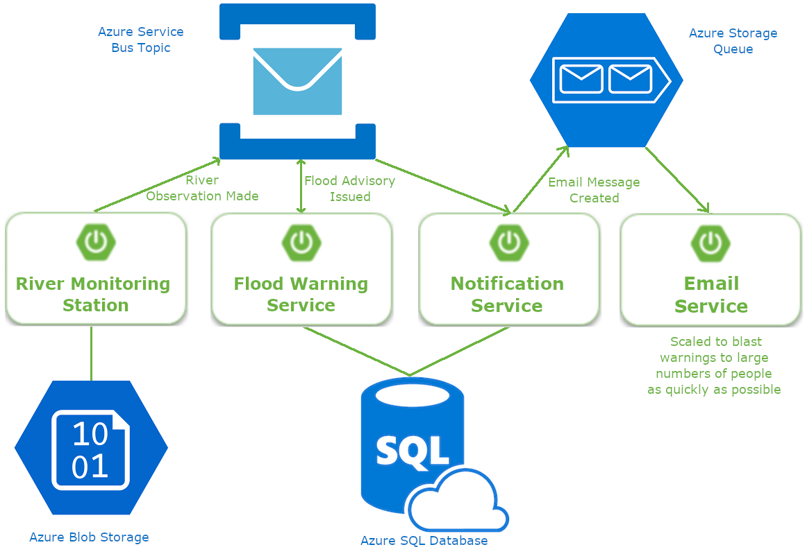

# Azure Water Monitoring System

The goal of this project is to demonstrate multiple Azure technologies, including:
* Azure Service Bus
* Azure SQL Database
* Azure Storage Blobs

It is a flood warning system that consumes river level measurements from a monitoring station to compute flood advisory notifications.
It uses event-driven architecture. The heart of the system is a simulator that sends incrementing river level events when the Monitor Station project starts.



I've forgone a gateway, the discovery service, and configuration service to focus on Azure technology. That means that the monitor station publishes directly to Azure and doesn't go through a gateway. There won't be a user interface. When you launch the projects, the events and notifications appear in the projects' console logs.

## Monitoring Stations
Uses a sensor to measure river level.

### API
* PUT void /api/v1/stationPreferences: StationPreferences
* GET StationPreferences /api/v1/stationPreferences/{stationId}

### Events
* River observation made

## Flood Warning Service
Uses data collected from monitoring stations to detect flood stage:
* 5 - Major Flooding
* 4 - Moderate Flooding
* 3 - Minor Flooding
* 2 - Near Flood Stage
* 1 - No Flooding
* 0 - At or Below Low Water Threshold

### Events
* River Advisory Issued

## Notification Service

### API
* POST void /api/v1/notificationPreferences: NotificationPreferences notificationPreferences
* DELETE void /api/v1/notificationPreferences/{emailAddress}

### Events
* notificationSent

## API Gateway

### API
* void changeStationPreferences: StationPreferences preferences
* StationPreferences getStationPreferences: String stationId
* List riverForecast: String stationId
* void addRecipient: NotificationPreferences notificationPreferences
* void removeRecipient: String emailAddress

### Events
* stationOnline
* stationOffline
* measurementObserved

# Running this Example

Each project has it's own read about how resources were created on Azure
if you wish to create your own. If you choose to create your own resource
you will need the Azure CLI and, at a minimum, the a free trial account.

# Azure Setup

Each of the child project has its own README file that covers the creation of Azure
resources need by that project. Follow the README instructions in this order:
1) This README.
2) Monitor Station README.
3) Flood Warning Service README.

Here we will login to Azure to create a Resource Group under which all Azure resources
for the all projects will be created.  

## Install the Azure CLI
Follow the instructions to install the Azure CLI and login
(https://docs.microsoft.com/en-us/cli/azure/install-azure-cli?view=azure-cli-latest).
```
az login
```

## Create a Resource Group
Begin by looking at the list of Azure locations to find the location you wish to use.
```
az account list-locations -o table
```

I chose the "centralus location". Name the group anything you want. I used the name "azure-training" for this exercise.

### Find Available Resource Group Name
```
export GROUP=azure-training
az group create --name $GROUP --location centralus

```
